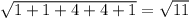

# Estimating Text Similarity by Shingling

**Authors:** Ármin Zavada, Kristóf Marussy

**Based on work of:** Gábor Bergmann, Gábor Szárnyas

## Overview

The recurring algorithmic problem used in this practice is a simple method of estimating **similarity of text documents**, which forms the basis of various text mining techniques used in industry for detecting plagiarism, giving automated recommendations, finding related documents in a large repository, or classifying documents based on language and/or stylistic similarities within a language.

Documents are processed as a sequence of **tokens**, where the **granularity** of tokens can either be whole words or individual characters. An **n-gram** is just a sequence of n consecutive tokens (characters or words) occurring in a document; very often, bigrams (*n* = 2) or trigrams (*n* = 3) are used. If adjacent n-grams collected from a **block** of text are allowed to overlap, they are called **shingles**, named after the overlapping ceramic shingles (tiles) that cover rooftops. So with e.g. *n* = 4 and word-level granularity, the first four words (words no. 0-3) will form a shingle, words no. 1-4 form another one, as do words no. 2-5, etc., as a sliding window. Additionally, the first three words also count as an **incomplete** shingle, and so do the last three words; the first two words and the last two words are likewise shingles, and finally the first word as well as the last word are single-token shingles as well.

Usually, the entire text of the document is broken down into blocks, and shingles are not allowed to stretch over adjacent blocks. Incomplete shingles thus form at the boundary between blocks, in addition to the beginning or at the end of the entire document. Blocks are defined as sentences in cases where whole words are considered as tokens, while individual words may serve as blocks if the tokens are of the granularity of single characters.

Furthermore, before extracting the shingles of a block, all capital letters are replaced by their lower case versions, as the concept of lower case / upper case distinction is considered as unnecessary noise for the purposes of document comparison.

The core idea of shingling-based document comparison is that two documents can be considered similar if they mostly contain the same shingles, occurring in more or less the same relative proportions. A quantitative measure of such relatedness of documents is given by **cosine similarity**; ranging from 0 to 1, very similar documents will have a cosine similarity close to 1, while the value of 0 indicates complete dissimilarity (no common shingles). The cosine similarity value is the cosine of the angle between the **occurrence vectors** digested from each document. This occurrence vector of the document contains, for each possible shingle, the number of times that shingle was found in the document; so it is a vector embedded in an infinite-dimensional vector space spanned by the shingles as base vectors, hence the name. The cosine value is computed the exact same way it is done in 3-dimensional Euclidean geometry: by dividing the **scalar product** of the two vectors by the **magnitude** of each vector, where the magnitude of a vector is of course the square root of the scalar product of the vector with itself. An important property of cosine similarity is that a document (containing closed blocks) and another text consisting of multiple identical copies of the original document will be associated with occurrence vectors that are parallel and differ only by a scaling factor; thus their similarity will be maximal (1.0).

Although in practice, a single document usually has to be compared against a repository of reference documents, here we only compare pairs of documents, eliminating the need for persistent storage and information retrieval aspects for the sake of simplicity. Likewise, the criteria given below for splitting the document into blocks and tokens are much simpler than those demanded by real-life applications.

Students interested in text mining and document similarity based techniques can optionally learn more from the [literature on the general theory](http://nlp.stanford.edu/IR-book/html/htmledition/irbook.html) and [off-the-shelf open source implementations](https://lucidworks.com/post/whats-a-shingle-in-lucene-parlance/). However, such background knowledge will not be required for completing this laboratory course.

## Implementation

This repository contains an implementation of the Shingling algorithm. The main shingling algorithm are split into the following steps: Tokenization, Shingle Collection, Scalar Product and Cosine Similarity computation.

Each of the steps is implemented as a separate class (Logic package) with well-defined interface between them (Lib package).

### Tokenization

For our purposes, a document is a string of characters. As mentioned previously, the **granularity** of tokens is either words or characters.

* If the chosen **granularity is character-level** tokenization, then blocks are defined as words: the maximal nonempty substrings of the document consisting of alphanumeric characters of the English alphabet (`a-zA-Z0-9`). However, capital letters in words have to be replaced with their lower case forms. Tokens are defined as the individual characters making up the (lower case) word.

* In case the **granularity of tokenization is words** (w-shingling), blocks are defined as the maximal nonempty substrings of the document separated by one or more full stop, exclamation or question mark characters (but not comma). However, capital letters in such "sentence" blocks are, once again, to be replaced with their lower case forms. Tokens are the words occurring in such a (lower case) "sentence", with word separation as defined in the previous paragraph.

### Shingle Collection

If the specified shingle size is *n*, then a block *B* consisting of tokens *B[i]*, with *i* spanning 0...Length(*B*) − 1, will have the following shingles:

* the inner complete shingle starting at position *j*, with *j* spanning 0...Length(*B*) − *n*, is the tuple

* the incomplete head shingle of length *l*, with *l* spanning 1...min(*n* − 1, Length(*B*)), is the tuple

* the incomplete tail shingle of length *l*, with *l* spanning 1...min(*n* − 1, Length(*B*) − 1) (note the difference), is the tuple

**Example:**  the document `I thank you!` has the following character **bigram shingles**:

* `i` (head)
* `t` (head)
* `t`, `h`
* `h`, `a`
* `a`, `n`
* `n`, `k`
* `k` (tail)
* `y` (head)
* `y`, `o`
* `o`, `u`
* `u` (tail)

Likewise, the document `Join me, and together, we can rule the galaxy as father and son! Come with me.` has the following **trigram w-shingles**:

* `join` (head)
* `join`, `me` (head)
* `join`, `me`, `and`
* `me`, `and`, `together`
* `and`, `together`, `we`
* `together`, `we`, `can`
* `we`, `can`, `rule`
* `can`, `rule`, `the`
* `rule`, `the`, `galaxy`
* `the`, `galaxy`, `as`
* `galaxy`, `as`, `father`
* `as`, `father`, `and`
* `father`, `and`, `son`
* `and`, `son` (tail)
* `son` (tail)
* `come` (head)
* `come`, `with` (head)
* `come`, `with`, `me`
* `with`, `me` (tail)
* `me` (tail)

For a document *D* consisting of blocks Block(*D*)[*k*], with *k* spanning 1...BlockCount(*D*), the occurrence vector is defined as a function that maps string tuples to nonnegative integers, counting the number of times a shingle occurs at different positions in any of the blocks (either as inner, head or tail shingle).

### Scalar Product

For occurrence vectors *U* and *V*, the scalar product *U ⋅ V* is defined as the sum of products of individual coordinates at corresponding positions.

### Cosine Similarity

Finally, the cosine similarity of the two incoming *U* and *V* vectors can be calculated by computing the uu, uv, vv scalar products, and computing the `uv / sqrt(uu * vv)` equation.

### Example

**Example:** the document `Banana` has the following character bigram shingle occurrence vector *U*:

* `b` -> 1
* `b`, `a` -> 1
* `a`, `n` -> 2
* `n`, `a` -> 2
* `a` -> 1

The magnitude of this vector is . On the other hand, the document Ananas is digested into the following vector:

* `a` -> 1
* `a`, `n` -> 2
* `n`, `a` -> 2
* `a`, `s` -> 1
* `s` -> 1

This second vector has the same magnitude as the previous one. The scalar product of the two vectors is the summation of the following non-zero terms:

* `1 * 1` (for shingle `a`) +
* `2 * 2` (for shingle `a`, `n`) +
* `2 * 2` (for shingle `n`, `a`)

Thus, the scalar product evaluates to 9. This makes the cosine similarity equal to . Overall, one can say that the two documents `Banana` and `Ananas` are pretty similar.

### Applications

Two example applications are realized using the above defined classes: Diversity and Similarity estimators, residing in their corresponding packages.
