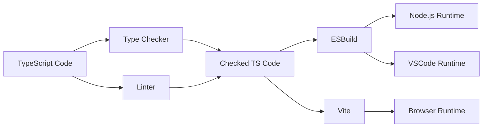

## Introduction

In the last laboratory session, you developed a rudimentary TypeScript application for processing students' grade data with Personally Identifying Information (PII) in a consent-aware data integration environment. Namely, the average and pass-rate calculator components are given a data set without PII data because the students did not give them consent to use their personal information.

In this laboratory session, you will create a domain-specific language to 1) describe the data, stakeholders, and service chains **without implementation detail**; and 2) implement **automated compliance checks** to ensure the stakeholders' **consents are respected**.

The expected learning outcomes of this session are the following.

 - 🎯 You should have sufficient skill to define grammar with custom scoping logic.
 - 🎯 You should be able to create compliance validation checks.
 - 🎯 You should grasp how to create basic language support using web technologies.

### Notation

> [!TIP]
> We try to annotate parts of the guide using the following notation.

Regular text: Information related to the laboratory.

💡 Extra insights about the current topic.

✏️ You should perform some specific exercise.

📋 You should check something and write down your experience.

🔍 You should do some research to continue.

### Suggested Reading

 - **Related practice material**: [Practice 4 - Textual editors](https://github.com/ftsrg-edu/ase-labs/wiki/Practice-4-%E2%80%90-Textual-editors)
 - **LSP Overview**: https://microsoft.github.io/language-server-protocol/overviews/lsp/overview/
 - **Langium docs**: https://langium.org/docs/
   - [Grammar specification](https://langium.org/docs/learn/workflow/write_grammar/)
   - [Resolve cross-references](https://langium.org/docs/learn/workflow/resolve_cross_references/)
   - [Create validations](https://langium.org/docs/learn/workflow/create_validations/)
   - [General Reference](https://langium.org/docs/reference/)
   - [Recipes](https://langium.org/docs/recipes/)
 - **VSCode Documentation:** https://code.visualstudio.com/docs
   - [Debugging](https://code.visualstudio.com/docs/editor/debugging)

## Starter Project

Developing domain-specific languages is a difficult process, which is made even more complex if we want to support multiple frontend applications. The [Language Server Protocol](https://microsoft.github.io/language-server-protocol/overviews/lsp/overview/) has been created as an abstraction between the language processing logic (tokenizing, lexing, linking, validating, content assist, etc.) and the presentation logic. Doing so allows the reuse of the same LSP server between multiple presentation technologies.

Langium is a modern language engineering tool with first-class support for LSP, written for the web. Langium provides a project generator using the [Yeoman generator](https://www.npmjs.com/package/yeoman-generator). However, it uses outdated and vulnerable packages, which are not recommended today. To save time, we have assembled a starter project with all the required scaffolding already in place and up-to-date, so you don't have to. **You can find the starter project at the [`lab-2`](https://github.com/ftsrg-edu/ase-labs/tree/lab-2) branch of this repository.**

We use Langium to define the grammar and generate the necessary infrastructure to run our language server. We are using three applications: 1) a CLI application that validates the `.dataspace` files and writes out the result; 2) a VS Code extension to develop `.dataspace` models; and 3) a web application showcasing the browser support.

### Project Structure

The structure of the project is outlined below. Relevant files, which you must edit, are marked with `*`.

```plaintext
data-space-editor/
├─ .vscode/                               # VSCode configuration files
├─ dist/                                  # JS code compiled by esbuild
├─ web-dist/                              # JS code compiled by vite for the Web
├─ gen/                                   # Auto-generated Langium files
├─ node_modules/                          # Downloaded NPM dependencies
├─ src/
│  ├─ language/                           # Langium-specific code (modules, grammar)
│  │  ├─ runner/                          # LSP entrypoints
│  │  ├─ data-space-module.ts             # The language module
│  │  ├─ data-space-validator.ts (*)      # The model validator component
│  │  ├─ data-space-scope-provider.ts (*) # The scope provider component
│  │  └─ data-space.langium (*)           # The grammar definitions of the language
│  ├─ extension/                          # The VSCode extension entrypoint
│  ├─ cli/                                # The Cli entrypoint
│  └─ web/                                # The Web entrypoint
├─ package.json
├─ ...
└─ .gitignore
```

**data-space.langium (*)**: The grammar of the data-space language lives here. It contains an initial grammar for the definition of basic, flat schemas.

**data-space-validator.ts (*)**: All validation checks are implemented here. There are some predefined validation checks to start from.

**data-space-scope-provider.ts (*)**: By default, references are resolved using the FQN of the elements. However, there are some cases when we want to resolve specific parts of the model based on semantic data. We have prepared the skeleton of the scope providing logic for you here.

💡 If you are interested, feel free to look around in the code base and figure out how the LSP is set up to run across the 3 platforms.

### Build Workflow



We are running the same *Type Checker* and *Linter* steps as before, but now our bundling is performed for the *cli* and *VSCode* environments by *esbuild* and for the *web* by *vite*. All build scripts are defined inside the *package.json* file, e.g., `build` or `check`.

## Tasks

### Running Example

QSWorldUniversity ranking is a well-known ranking of universities across the world. This running example describes a service chain that connects an imagined University to this ranking service while respecting the Students' PII consents.

The system has multiple stakeholders. The **University** has a list of their **Student**s, but their grades are stored in the **Moodle** system: Moodle can map each student to their grades. Since **QSWorldUniversity** does not (and should not) trust the University to calculate the aggregate data, we offload the task to a mutually agreed upon **AnalyticsCompany**. Finally, the aggregate results are sent to the QSWorldUniversity database.

PII concerns arise as the **Students** only gave consent to the Moodle system, and do not give consent to use their data annotated with PII to neither the **AnalyticsCompany**, nor the **QSWorldUniversity**. Thus, you need to ensure the aggregate reaches the database without PII consent violation.

### Task 1: Project Onboarding (2 points)

As the first task, let's familiarize yourself with the build and development environment! The starter project contains some *launch* configurations that can be used to run and debug the VSCode extension.

✏️ First, let's initialize the project by executing `npm install` and then `npm run build`. Next, open the `Run and Debug` view (<kbd>Ctrl</kbd>+<kbd>Shift</kbd>+<kbd>D</kbd>), and choose the `Run Extension (without LSP debug)` launch configuration!

This launch configuration builds the project and starts a new VSCode instance called the **extension host** with the `data-space-editor` extension installed.

> [!WARNING]
> Your host VSCode may complain that the launch takes longer than usual. Be patient; the build should complete, and the extension host will eventually start.

The first time your extension host is started, it will show an empty workspace. Due to how VSCode extensions are loaded, the extension is not started until a `.dataspace` file is found. 

✏️ To start the extension, open a new folder in the extension host and create a new `students.dataspace` file. Paste the following code inside your newly created file:

```
schema dataType
schema StudentData {
    age: number
    age: number
    @PII Id: string
}
schema StudentData
```

📋 The file should be syntax highlighted, and the editor should give you content assist. Do you notice anything strange? What are the yellow/red markers? What section of the code causes them?

---

✏️ Now that you have a working extension host, you can try to debug your code! To do so, open the `Run and Debug` view (<kbd>Ctrl</kbd>+<kbd>Shift</kbd>+<kbd>D</kbd>), and choose the `Run Extension (LSP debug) + Attach to Language Server` launch configuration!

This launch configuration builds the project, starts an extension host with the `data-space-editor` extension installed, and attaches a debugger. It also configures the LSP server to run in debug mode and starts a second **attach** task, which connects to the LSP server. 

> [!CAUTION]
> Please make sure to have a `.dataspace` file in the workspace before running the debugger launch configurations! Synchronization is needed between the extension, LSP server, and the two debuggers. Since the LSP server will wait for a debugger, it will only start after someone attaches to it (even though the extension is already running). However, the extension only activates if there is a `.dataspace` file present in the workspace; otherwise, the LSP server will not be started. Although the LSP debugger is configured with a 2-minute timeout window, there is a possibility it timeouts before the LSP server is started, deadlocking the language service. 
> 
> To fix, stop the started processes, create a `.dataspace` file using the previous launch configuration, and retry.

If everything works correctly, VSCode should break at the first character of the `is.js` file. Resume execution to start the language services. You can start the last launched configuration using <kbd>F5</kbd> whenever you need to restart the extension.

✏️ Next, place a breakpoint at the first line of the `data-space-validator.ts#validateCapitalizedSchemas()` function, and edit your `.dataspace` file.

> [!WARNING]
> Due to a limitation in VSCode, compound launch configurations do not stop as one. As a result, if you stop the extension host, the remote debugger will still run, preventing you from starting a new extension host with <kbd>F5</kbd>. To fix it, make sure to always stop it manually.

📋 If done correctly, VSCode should break at the set breakpoint. Play around with the debugger, and write down your experiences!

---

The CLI and Web components are examples of how to use the technology in different contexts. In the next laboratory sessions, the CLI component will be used to generate code, however, in the current one we will use it to validate `.dataspace` files.

✏️ To do so, run it using the familiar `node dist/cli/main.cjs validate path/to/your/file.dataspace` command. Try it with some deliberately (syntactically and semantically) incorrect files.

📋 Document your results! Make sure to store your example models as well!

💡 Optionally, you can also try out the web editor by starting a development server using the `npm run web:dev` command and navigating to the specified URL. Make sure to stop the server once done, as it consumes a lot of resources!

💡 There are additional scripts inside the `package.json` file providing various useful configurations. You can play around with them, but note that misuse may break your project!

### Task 2: Stakeholder Specification (3 points)

The Schema language allows you to define data in a *flat record* form. Instead of hierarchical data with composite schema definitions, each data point can be considered a record of that data, containing all the necessary information to piece it back together. This way, the data can be streamed in real-time through the service chain, and it also simplifies the language for the purposes of this laboratory session.

Here is the StudentData in record form, similar to how it was introduced in the last laboratory session.

```
schema StudentData {
    @PII name: string
    @PII studentId: string
    age: number
}
```

Stakeholders are people or agencies that can *own*, be a *subject of*, *provide services* to process, or *consume* data sets. If a stakeholder is a *subject of* another stakeholder's data, it may give *consent to* specific stakeholders to access their personal information **in the specified data set**. Consent is explicit: not giving consent means the given stakeholder **MUST NOT** gain access to their PII data in the specified data set!

```
stakeholder University {
    owns dataset students: StudentData
}
stakeholder Student {
    subject of University.students {
        gives consent to Moodle
    }
}
stakeholder Moodle // can receive University.students with PII data
stakeholder AnalyticsCompany // must not receive University.students with PII data
stakeholder QSWorldUniversity // must not receive University.students with PII data
```

In Langium, references are resolved by the **Scope Provider**. The default scope provider implementation resolves to the *fully qualified names* available in the model. This works well enough by default, however, there are cases when we want to calculate the scope based on language *semantics*. For example, `University.students` is not resolved by default because there is no element with that FQN, but we know that after the dot, we have access to the properties of `University`. To fix this, we can extend `data-space-scope-provider.ts` to return the data sets contained in the referenced stakeholder so Langium can find and link the elements.

✏️ Extend `data-space.langium` with Stakeholders using the example provided. For now, only implement the `owns dataset ...` and `subject of ...` parts.

🔍 If stuck, you should consult the Langium reference and examples documentation.

📋 You should be able to parse the example model defined above. Try to play with the editor. Does it function like you expected?

<details>
<summary>Hint for the Grammar</summary>

```
DataSet:
    'owns' 'dataset' name=ID ':' schema=[Schema]
;

SubjectOfRelation:
    'subject' 'of' stakeholder=[Stakeholder] '.' dataSet=[DataSet] ('{'
        ('gives' 'consent' 'to' consents += [Stakeholder])*
    '}')?
;

Stakeholder:
    'stakeholder' name=ID ('{'
        (
            dataSets += DataSet
            | subjectOfRelations += SubjectOfRelation
        )*
    '}')?
;
```
</details>

<details>
<summary>Hint for the Scope Provider</summary>

```typescript
// if the reference's name is 'dataSet', and the container is a 'SubjectOfRelation'
if (context.property === 'dataSet' && isSubjectOfRelation(context.container)) {
    const subjectOfRelation = context.container;
    // 'stakeholder' is a reference, thus '.ref' holds the actual value
    const stakeholder = subjectOfRelation.stakeholder.ref;
    if (stakeholder) {
        // return the referenced stakeholder's dataSets as scope if not undefined
        return this.createScopeForNodes(stakeholder.dataSets);
    } else {
        // or empty scope, otherwise.
        return EMPTY_SCOPE;
    }
}
```
</details>

---

Stakeholders may also *provide services* and *consume datasets*. Services take incoming *records* and return other *records*, both specified in terms of Schema definitions.

```
schema StudentGrade {
    @PII name: string
    @PII studentId: string
    year: number
    term: string
    courseName: string
    credits: number
    signature: boolean
    finalGrade: number
}
schema PseudonymizedStudentGrade {
    id: string
    year: number
    term: string
    courseName: string
    credits: number
    signature: boolean
    finalGrade: number
}
schema StudentAggregate {
    id: string
    year: number
    term: string
    credits: number
    average: number
    correctedAverage: number
}
stakeholder Moodle {
    // can receive 'University.students' with PII data
    provides service calculateGrades: StudentData -> StudentGrade
}
stakeholder AnalyticsCompany {
    // must not receive 'University.students' with PII data
    provides service calculateAggregate: PseudonymizedStudentGrade -> StudentAggregate
}
stakeholder QSWorldUniversity {
    // must not receive 'University.students' with PII data
    consumes dataset recordAggregate: StudentAggregate
}
```

✏️ Extend the language with `provides service` and `consumes dataset` elements.

📋 You should be able to parse the extended example model defined above.

---

Validation rules provide a mechanism to evaluate the model's compliance with certain well-formedness rules automatically. There are some example validation checks in `data-space-validator.ts`.

✏️ Extend `data-space-validator.ts` with checks that give `error` markers when defining duplicate elements in stakeholders. Next, create 1 custom validation rule that returns `warning` markers, e.g., incorrect name capitalization.

📋 Create 2 models that trigger specific validation checks. Try them with the extension and the CLI validator components. Document your models and your findings.

<details>
<summary>Hint for the Validator</summary>

```typescript
export function registerValidationChecks(services: DataSpaceServices) {
    const checks: ValidationChecks<DataSpaceAstType> = {
        Stakeholder: [
            validator.validateUniqueElementsInStakeholder,
        ]
    }
}
export class DataSpaceValidator {
    validateUniqueElementsInStakeholder(this: void, stakeholder: Stakeholder, accept: ValidationAcceptor): void {
        const names = new Set();
        stakeholder.services.forEach(s => {
            if (s.name) {
                if (names.has(s.name)) {
                    accept('error',  `Service has non-unique name '${s.name}'.`,  {node: s, property: 'name'});
                }
                names.add(s.name);
            }
        });
        stakeholder.dataSets.forEach(s => {
            if (s.name) {
                if (names.has(s.name)) {
                    accept('error',  `Dataset has non-unique name '${s.name}'.`,  {node: s, property: 'name'});
                }
                names.add(s.name);
            }
        });
        // ... services and consumes
    }
}
```
</details>

### Task 3: Service Chain Specification (5 points)

With the defined schemas and stakeholders, custom **service chains** can be defined that specify how data flows through the system.

```
service chain CollectUniversityRankingData {
    first University.students
    then Moodle.calculateGrades
    then AnalyticsCompany.calculateAggregate
    then QSWorldUniversity.recordAggregate
}
```

✏️ Extend the language with service chain definitions. Ensure (with either the grammar or by specifying validation checks) that the chain must start with a dataset, go through services, and end with a consumer.

📋 You should be able to parse the model extended with the provided service chain. Create 2 simple models that violate some chain rules and document them.

The system can automatically pass information between services with the same schemas (output = input). However, it can not perform an implicit conversion between different types. The example `AnalyticsCompany.calculateAggregate` requires a different type of input than what `Moodle.calculateGrades` returns. An explicit conversion can be specified using a `mapping` during the step.

```
// Without mapping
service chain CollectUniversityRankingData {
    first University.students
    then Moodle.calculateGrades
    // Error: incompatible data types: 
    //  Moodle.calculateGrades returns (StudentGrade) while 
    //  AnalyticsCompany.calculateAggregate requires (PseudonymizedStudentGrade)!
    then AnalyticsCompany.calculateAggregate
    then QSWorldUniversity.recordAggregate
}
// With mapping
service chain CollectUniversityRankingData {
    first University.students
    then Moodle.calculateGrades
    then AnalyticsCompany.calculateAggregate {
        id <- studentId
        year <- year
        term <- term
        courseName <- courseName
        credits <- credits
        signature <- signature
        finalGrade <- finalGrade
    }
    then QSWorldUniversity.recordAggregate
}
```

✏️ Extend the steps with optional mappings. Make sure to correctly implement the scoping between the arrows' left and right sides. Write a validation check that returns `error` markers where implicit conversion is not allowed!

📋 You should be able to parse the provided example without errors.

With the type-compatibility issue handled, the consent violation problem remains. In the above example, we can see that although Student did not give consent to AnalyticsCompany to handle their data, they have indirectly received it. Notice that even though `schema PseudonymizedStudentGrade.id` is not annotated as PII, its value is derived from one (studentId), which is a consent violation!

```
service chain CollectUniversityRankingData {
    then Moodle.calculateGrades
    then AnalyticsCompany.calculateAggregate {
        // Error: AnalyticsCompany.calculateAggregate receives unconsented PII data through 'studentId'!
        id <- studentId
    }
}
```

PII violations can be handled by pseudonymizing data inside a mapping using the `pseudonymize(value)` keyword.

```
service chain CollectUniversityRankingData {
    then Moodle.calculateGrades
    then AnalyticsCompany.calculateAggregate {
        id <- pseudonymize(studentId)
    }
}
```

✏️ Next, implement a validation check returning `error` markers at PII consent violations and extend the language with the `pseudonymize` keyword, which solves the error.

✏️ Finally, consider additional ways private information may leak to non-consented stakeholders and create validation checks for them.

<details>
<summary>Hint</summary>
What about PII data in implicit conversions?
</details>

📋 Create 3 models showcasing the final suite of consent violation checks, and document your findings. Would you consider this DSL helpful in defining complex consent-aware PII service chains? What would make it more helpful?

## Extra Task: VSCode Extension Package (3 IMSc points)

In this session, we used development-grade bundles of our application to run and debug them; however, this is not optimal in production. Additionally, users of the extension may not want to compile the extension themselves but install it from the [VSCode extension marketplace](https://code.visualstudio.com/docs/editor/extension-marketplace). [Publishing an extension](https://code.visualstudio.com/api/working-with-extensions/publishing-extension) makes it available to any user with compatible VSCode installation.

✏️ Bundle the VSCode extension into a `.vsix` file using the `vsce` tool created by Microsoft. Make sure to configure the tool correctly (e.g., which files to include?), and do not bundle development-grade artifacts!

> [!TIP]
> Look around in the `package.json` file for predefined scripts. You can also define your own bundling scripts as needed!

📋 Install the resulting `.vsix` file into your host VSCode application, and try your models created before! Does it function as the development version?

> [!CAUTION]
> Do not try to run the `web:build` script to build a production-grade bundle of the web application! Unfortunately, it seems the current version does not work correctly due to a library loading error.
